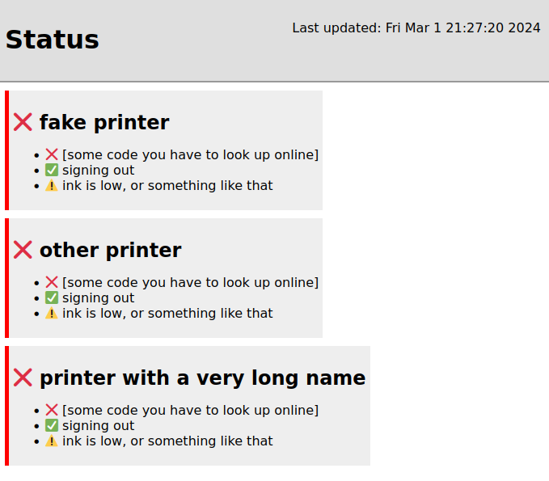

# nopaper

nopaper generates an overview page with the status of certain HP printers.
I don't know how the EWS (Embedded Webserver) looks across different models,
so you will need to check if yours is compatible with the script.

## Requirements
This script uses `jinja2` and `requests`.

## Usage

Copy `printers.example.json` to `printers.json`, and add printers.

**THIS SCRIPT ACCEPTS SELF SIGNED CERTS!** If your printers have proper certificates,
set `verify` to `true` `in printers.json`.

Then run the script. It will check each one then write to `index.html` in the
current directory.

It must be run in the same directory as `printers.json` and `index.j2.html`:

`python3 nopaper.py`

Now you can serve `index.html`! If you need regular updates, use a shell loop, cron job, systemd timer etc.
